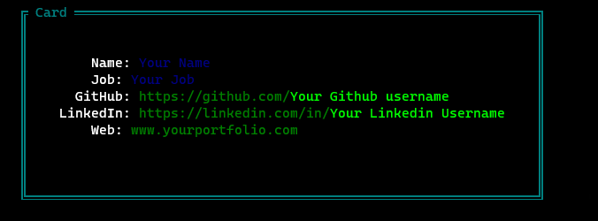

# CLI Business Card:

## How to use:
- Edit the `userData` object with your information
- in your terminal, run `node index.js`

## Output:

## Packages Used:
- chalk:[Terminal string styling](https://github.com/chalk/chalk)
- boxen: [Create Boxes in Terminal](https://www.npmjs.com/package/boxen)