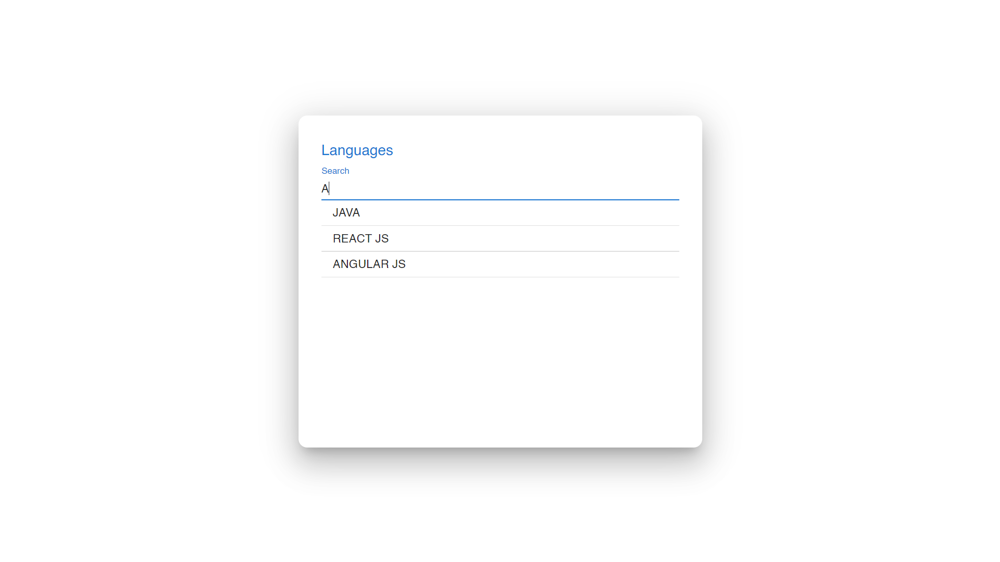
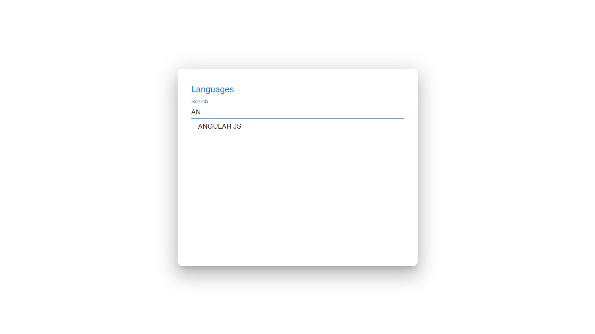

#Search by a Field on React Table
This app basically allows the user to filter through table rows by reading characters from the user using MUI TextField. The rows are populated on each character entered by the user.

